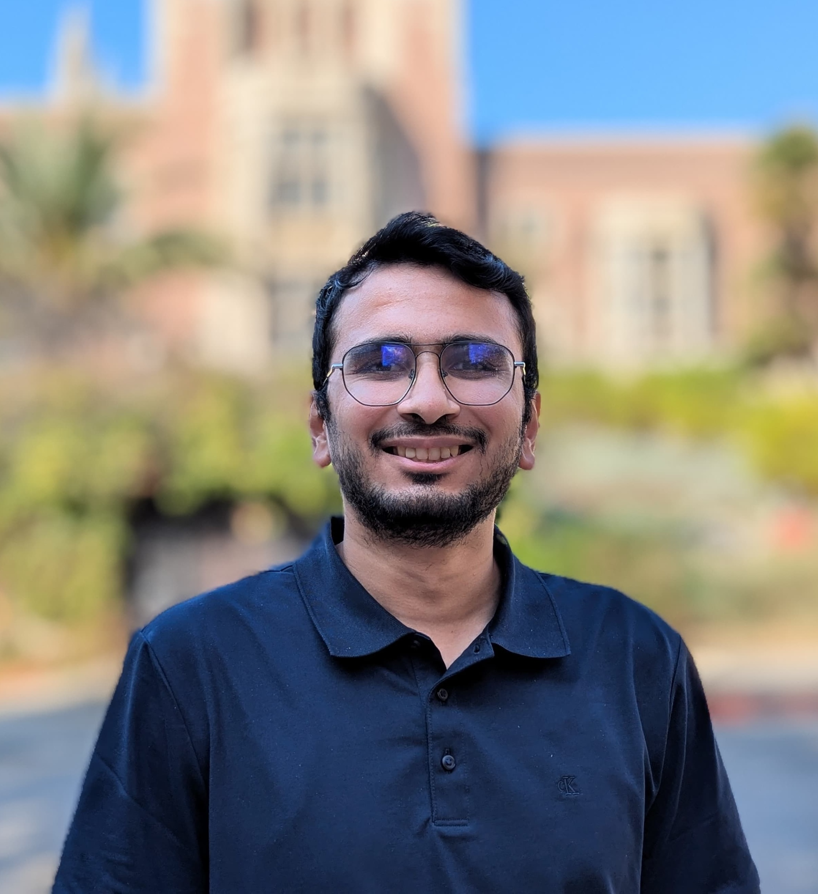

---
# You don't need to edit this file, it's empty on purpose.
# Edit theme's home layout instead if you wanna make some changes
# See: https://jekyllrb.com/docs/themes/#overriding-theme-defaults
layout: default
---
{:style="float: left;margin-right: 15px;margin-top: 7px; margin-left: 7px;height: 200px;border: 5"}

Hey there! I am a fouth year PhD student in Computer Science at [University of California, Los Angeles](https://samueli.ucla.edu/). I am being adviced by [Prof. Nanyun Peng](https://vnpeng.net/) and [Prof. Kai-Wei Chang](http://web.cs.ucla.edu/~kwchang/). My research focuses on improving the utilization of Large Language Models (LLMs) for applications in Information Extraction (specifically Event Extraction) across various languages and domains.

I graduated as a Masters student from [Language Technologies Institute (LTI)](https://www.lti.cs.cmu.edu/) at Carnegie Mellon University. There, I was advised by [Prof. Alan W. Black](http://www.cs.cmu.edu/~awb/) and worked on topics like style transfer and code-switched dialogue systems. Previously, I received my undergraduate degree -- Bachelor of Technology in Computer Science -- from [IIT Bombday](https://www.cse.iitb.ac.in/). As part of my thesis, I worked on Language Modelling for code-switched language under the guidance of [Prof. Preethi Jyothi](https://www.cse.iitb.ac.in/~pjyothi/).

As part of PhD internships, I have interned at [Meta Gen AI](https://ai.meta.com/meta-ai/) (Summer 2024) and [Amazon Lab 126](https://amazon.jobs/en/teams/lab126/) (Summer 2022). Before, I worked full-time for a year in the Machine Learning team at [Amazon](https://www.amazon.jobs/en/landing_pages/india-machine-learning). I have previously interned at [Goldman Sachs](https://www.goldmansachs.com/worldwide/india/) (Summer 2017), [Philips](https://www.philips.co.in/a-w/about-philips/philips-innovation-center.html) (Summer 2016), [Edelweiss](https://www.edelweissfin.com/) (Winter 2015) and [Sportz Interactive](https://www.sportzinteractive.net/) (Summer 2015).

In my free time, I like to write poetry ([my blog](https://tanmayparekh.wordpress.com)) and paint. I love playing soccer, basketball, and tennis too.

---

### **Updates**

<table>
<col width="100px">
<col width="650px">

<tr><td><b>Jun 2024:</b></td><td>Started my internship in the <a href="https://ai.meta.com/meta-ai/">Gen AI team at Meta</a></td></tr>
<tr><td><b>Jun 2024:</b></td><td>Gave an poster presentation for <a href="https://arxiv.org/abs/2309.08943">CLAP</a> at NAACL 2024</td></tr>
<tr><td><b>Jun 2024:</b></td><td>Gave an oral presentation for <a href="https://arxiv.org/pdf/2404.01679">SPEED</a> at NAACL 2024</td></tr>
<tr><td><b>Jun 2024:</b></td><td>Awarded the <a href="https://www.sciencehub.ucla.edu/2024-amazon-fellows/">Amazon Fellowship</a> for the academic year 2024-2025</td></tr>
<tr><td><b>May 2024:</b></td><td>Our work on <a href="https://arxiv.org/pdf/2311.09562">TextEE</a> got accepted at ACL Findings 2024</td></tr>
<tr><td><b>Mar 2024:</b></td><td>Two of my works on <a href="https://arxiv.org/abs/2309.08943">CLAP</a> and <a href="https://arxiv.org/pdf/2404.01679">SPEED</a> got accepted at NAACL 2024</td></tr>
<tr><td><b>Mar 2024:</b></td><td>Passed my Oral Qualifying Examination and became a PhD Candidate</td></tr>
<tr><td><b>Nov 2023:</b></td><td>Arxived our work on Reevaluation of Event Extraction: Past, Present, and Future Challenges [<a href="https://arxiv.org/pdf/2311.09562.pdf">paper</a>]</td></tr>
<tr><td><b>Oct 2023:</b></td><td>Serving as the <b>Program Chair</b> for the <a href="https://socalnlp.github.io/symp23/index.html">Socal NLP Symposium 2023</a> </td></tr>
<tr><td><b>Sep 2023:</b></td><td>Arxived our work on Contextual Label Projection for Cross-lingual Structure Extraction [<a href="https://arxiv.org/abs/2309.08943">paper</a>]</td></tr>
<tr><td><b>Jul 2023:</b></td><td>Presented our work on Generalizability Benchmarking Dataset for Event Argument Extraction at ACL 2023 [<a href="https://aclanthology.org/2023.acl-long.203/">paper</a>]</td></tr>
<tr><td><b>Jun 2023:</b></td><td>Completed Teaching Assistantship for 3 courses - Machine Learning, Natural Language Processing (undergrad), Natural Language Processing (graduate)</td></tr>
<tr><td><b>May 2023:</b></td><td>Our work on Generalizability Benchmarking Dataset for Event Argument Extraction accepted at ACL 2023 [<a href="https://aclanthology.org/2023.acl-long.203/">paper</a>]</td></tr>
<tr><td><b>May 2023:</b></td><td>Gave a guest lecture for the CS 263 (Natural Language Processing) class at UCLA</td></tr>
<tr><td><b>Jun 2022:</b></td><td>Started my summer internship at <a href="https://www.amazon.jobs/en/landing_pages/india-machine-learning">Amazon Alexa</a> as an Applied Scientist Intern</td></tr>
<tr><td><b>May 2022:</b></td><td>Arxived our work on Generalizability Benchmarking Dataset [<a href="https://arxiv.org/abs/2205.12505">paper</a>]</td></tr>
<tr><td><b>Apr 2022:</b></td><td>Cleared the Written Qualifying Exam (WQE) towards my PhD</td></tr>
<tr><td><b>Oct 2021:</b></td><td>Granted the <b>UCLA PhD Fellowship</b> for the first year</td></tr>
<tr><td><b>Sept 2021:</b></td><td>Started my PhD in Computer Science at UCLA</td></tr>
<tr><td><b>Aug 2021:</b></td><td>Graduated as a Masters student in Language Technologies from CMU</td></tr>
<tr><td><b>Nov 2020:</b></td><td>Presented our work on linguistic accommodation for code-switched dialogues at CoNLL '20 [<a href="https://www.aclweb.org/anthology/2020.conll-1.46/">paper</a>]</td></tr>
<tr><td><b>Aug 2020:</b></td><td>Represented CMU at the Alexa Socialbot Challenge 3 and reached the Semifinals.</td></tr>
<tr><td><b>Jul 2020:</b></td><td>Our work on politeness transfer got featured in
    <a href="https://www.cs.cmu.edu/news/could-your-computer-please-be-more-polite-thank-you">SCS CMU News</a>,
    <a href="https://techcrunch.com/2020/06/30/cmu-researchers-develop-a-an-automatic-politeness-engine-for-text-based-communications/">TechCrunch</a>,
    <a href="https://www.cnet.com/news/ai-wants-to-make-your-writing-more-polite/">CNET</a>,
    <a href="https://www.post-gazette.com/business/tech-news/2020/07/09/Carnegie-Mellon-University-Language-Technologies-automated-politeness-emails/stories/202007080139">Pittsburgh Post-Gazzette</a>,
    <a href="https://www.msn.com/en-us/news/technology/ai-save-me-from-my-rude-self-please/ar-BB16v8wc?li=BBnbcA1">MSN</a>,
    <a href="https://www.hindustantimes.com/more-lifestyle/automated-method-for-making-communications-more-polite-developed/story-bemfdrjiP08UdyPQgGJSbL.html">Hindustan Times</a>,
    <a href="https://www.axios.com/researchers-develop-polite-ai-c1fa8fdd-6615-4152-80e0-6f1fd649e315.html">Axios</a>
</td></tr>
<tr><td><b>Jul 2020:</b></td><td>Presented our work on politeness transfer at ACL '20 [<a href="https://arxiv.org/abs/2004.14257">paper</a>]</td></tr>
<tr><td><b>May 2020:</b></td><td>Reached the semifinals of the <a href="https://developer.amazon.com/alexaprize">Alexa SocialBot Challenge 2020</a></td></tr>
<tr><td><b>Aug 2019:</b></td><td>Joined the MLT program at LTI, CMU for Fall '19</td></tr>
<tr><td><b>Mar 2019:</b></td><td>Our work on Named Entity Recognition in partially and noisy labelled setting got accepted at AMLC '19</td></tr>
<tr><td><b>Nov 2018:</b></td><td>Presented our work on dual rnns to improve code-switched language models at EMNLP '18 [<a href="https://arxiv.org/abs/1809.01962">paper</a>]</td></tr>
<tr><td><b>Sep 2018:</b></td><td>Received the ISCA Student Grant</td></tr>
<tr><td><b>Sep 2018:</b></td><td>Presented our work on dual language models to improve code-switched speech recognition at Interspeech '18 [<a href="https://arxiv.org/abs/1711.01048">paper</a>]</td></tr>
<tr><td><b>Aug 2018:</b></td><td>Graduated from IIT Bombay</td></tr>
<tr><td><b>Jul 2018:</b></td><td>Started working as Applied Scientist at Amazon in the <a href="https://www.amazon.jobs/en/landing_pages/india-machine-learning">Machine Learning team</a></td></tr>
<tr><td><b>Dec 2017:</b></td><td>Invited to <a href="https://www.microsoft.com/en-us/research/lab/microsoft-research-india/">Microsoft Research India</a> to ideate and devlop Indian language technologies</td></tr>
<tr><td><b>May 2017:</b></td><td>Summer Internship at <a href="https://www.goldmansachs.com/worldwide/india/">Goldman Sachs</a></td></tr>
<tr><td><b>May 2016:</b></td><td>Summer Internship at <a href="https://www.philips.co.in/a-w/about-philips/philips-innovation-center.html">Philips Innovation Center</a></td></tr>
<tr><td><b>Dec 2015:</b></td><td>Winter Internship at <a href="https://www.edelweissfin.com/">Edelweiss</a></td></tr>
<tr><td><b>Jul 2015:</b></td><td>Secured branch change to Computer Science</td></tr>
<tr><td><b>May 2015:</b></td><td>Summer Internship at <a href="https://www.sportzinteractive.net/">Sportz Interactive</a></td></tr>
<tr><td><b>Jul 2014:</b></td><td>Joined IIT Bombay</td></tr>
